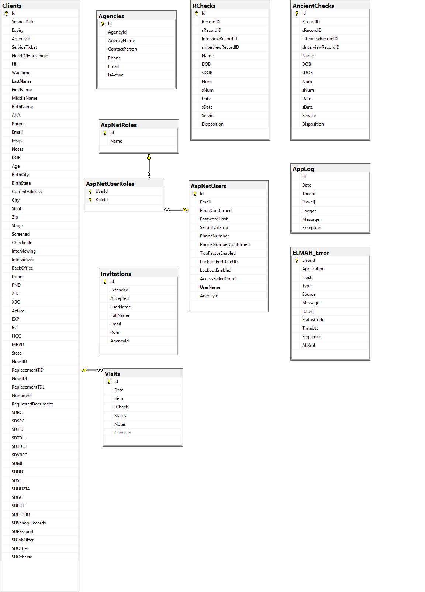

# Database
OPIDDaily is a database driven application built using SQL Server technology. In the desktop environment OPIDDaily is built using the Sql Server Express
database engine. In the online environment at AppHarbor a full SQL Server is used. The two versions are compatible with each other with respect to the
database features used. SQL Server Management Studio v18.0 (SSMS) is used to manage both database engines. In the desktop environment, Windows
Authentication is used to connect to the Sql Server Express database. In the online environment, SQL Server Authentication is used to connect to the
SQL Server database.

When application OPIDDaily was created at AppHarbor, a free version of SQL Server was added on through the AppHarbor interface. The connection string
to this SQL Server is found by selecting the SQL Server add-on and following the `Go to SQL Server` link on the page that appears. The value of this
connection string is stored as the value of Config.WorkingProductionConnection string on file Config.cs. The 3 components of the connection string,
HostName, UserName and Password, are also displayed on this page. The components may be used to configure a SQL Server Authentication connection to
the AppHarbor database through SSMS.

The same connection string displayed at AppHarbor is retrieved at runtime by accessing Config.ConnectionString, which returns the value of
**OpidDailyConnectionString** configured in the `<connectionStrings>` section of file Web.config. The statically configured value on file Web.Config points to
the OpidDailyDB on the desktop SQL Server Express. At runtime, AppHarbor will overwrite this statically configured value with the value displayed at
AppHarbor. See the section on the Connection String on this tab.

## Two Databases and a Hybrid System
The Apricot database is intended to be the repository of all truth about clients of Operation ID. It does well with the record keeping aspects of
a repository but falls short on two of the primary goals of the OPID Daily application:

* updating of the disposition of checks in the Apricot database by processing a Quickbooks report
* generating consolidated Service Tickets

Neither of these can be accomplished by Apricot alone. The updating of check dispositions must be done through the OPID Daily application, because Apricot does
not have the power of a general purpose programming language which is needed for this task. The generation of consolidated Service Tickets, an important
addition to the Operation ID workflow, can also not be performed by Apricot alone. Again, it is the lack of a general purpose programming language that
prevents Apricot from performing this task.

The consequence of these 2 shortcomings of Apricot has led to Operation ID being run as a **hybrid system** between the OPID Daily application and
the Apricot record keeping system. Each system maintains its own database and **bidirectional updating** is needed to keep the two databases in synch to
ensure the proper functioning of Operation ID. Without going into detail, the OPID application could take over the record keeping performed by Apricot
and become the single repository of truth about all clients of Operation ID. But it was found that Apricot could not be conveniently extended
beyond record keeping to be the single repository it was intended to be.

Apricot supports the generation of filtered reports exportable as Excel spreadsheets. In terms of database technology, an Apricot report is a database
view, a SQL query which when executed returns a collection of records of data drawn from the underlying Apricot database. A filtered report is a database query
which includes a SQL WHERE-clause. Filtered reports were made available to Apricot users to provide convenient windows upon the data in their Apricot
databases and to support construction of their own custom reports based on this data.

Filtered reports are also the key to initially populating and ongoingly updating the OPID Daily application to keep it in synch with the record keeping
performed in the Apricot database. A filtered report called the Bounded Research Report was used to initially populate the OPID Daily database of checks.
The internal database of checks in application OPID Daily is what enables the generation of Service Tickets revealing the past visit history of a client.
The Bounded Research Report was used to create Excel spreadsheets containing a single year's worth of check data at a time. The Bounded Research Report for a
given (past) year was consumed by the OPID Daily application to enter check data belonging to that year into the OPID Daily database.

Since the construction of the database of checks from previous years, a second filtered report called the OPID Daily Report is now used to incrementally update
the OPID Daily database with new checks that have been recorded in Apricot. The OPID Daily report makes use of the modification date stored with records in the
Apricot database to retrieve the `delta`, that is only the records that have been modified since a specific date. The specific date supplied to the OPID Daily
report is its filter over all modified records. If record keeping were performed inside the OPID Daily application, then this updating would be unnecessary.
The Apricot database would only be needed to initially populate the OPID Daily database of checks.

The initial population of the OPID Daily database and its incremental updating by the use of the OPID Daily Report are how the OPID Daily database is kept
in synch by the Apricot database. Updating in the other direction is equally important. At the time that check numbers a recorded in the Apricot database,
the disposition of those checks (whether Cleared or Voided) is yet to be determined. The determination of the disposition of a check is referred to as
`resolving the check.` Checks are resolved by a pair of Quickbooks reports created as Excel spreadsheets after the bank used by Operation ID has reported on
cleared checks. The first report, called the Cleared Checks Report, lists checks cleared by the bank by check number. The second report, called the Voided
Checks Report lists by check number checks that are more than 90 days old and have been voided by Operation ID in instructions sent by Quickbooks to the bank.
Neither the Cleared Checks Report nor the Voided Checks Report in a format that can be consumed by Apricot to update its database. Apricot is very
stringent about the format a file must be in in order to be used to update its database.

OPID Daily is used to consume the Cleared Checks Report and the Voided Checks Report to resolve checks in its own database. After resolving checks listed
on these reports, application OPID Daily constructs an Excel spreadsheet in the stringent format required by Apricot in order to update its database. This
spreadsheet is referred to as an `importme` file, because it is imported into Apricot through the Apricot Administrator interface.

This is how the Apricot database is kept in synch with the OPID Daily database. Again, if record keeping functions were provided in OPID Daily, then keeping
the Apricot database in synch with the OPID Daily database would not be necessary.

**Bidirectional updating** is the means that has been worked out in order to realize the benefits of both Apricot and OPID Daily. This has resulted in
a hybrid system.

## Connection String
In the desktop environment, SSMS was used to create an empty project database by executing the SQL query

    create database OpidDailyDB

The Visual Studio Server Explorer (found under the OPIDDaily project View menu) was then used to discover the connection string to database OpidDailyDB
by creating a new Data Connection to it and copying the Connection String property of the data connection into the `<connectionStrings>` section of
Web.config.

    <add name="OpidDailyConnectionString" connectionString="data source=DESKTOP-0U83VML\SqlExpress;initial catalog=OPIDDailyDB;Integrated Security=True" providerName="System.Data.SqlClient" />

This value is accessed on files IdentityDB.cs and OpidDailyDB.cs by reading the value of the static variable Config.ConnectionString:

```
        public static string ConnectionString
        {
            get
            {
                // The value of OpidDailyConnectionString configured on Web.config is overwritten at AppHarbor deployment time.
                return ConfigurationManager.ConnectionStrings["OpidDailyConnectionString"].ToString();
            }
        }
```

The value of **OpidDailyConnectionString** is overwritten at application deployment time at AppHarbor. This is accomplished by setting the
connection string alias for the SQL Server add-on at AppHarbor to be **OpidDailyConnectionString**. To set this alias, select the SQL Server
add-on for application OPIDDaily at AppHarbor and then follow  the link `Go to SQL Server` on the page that appears. Click the button labeled
"Edit database configuration" to set **OpidDailyConnectionString** as the alias value for the connection string. When this is done,
**OpidDailyConnectionString** will appear as the value of SQLSERVER_CONNECTION_STRING_ALIAS in the Configuration variables section of application
OPIDDaily at AppHarbor. When application OPIDDaily is deployed at AppHarbor, this alias will overwrite the configured value of
**OpidDailyConnectionString** on file Web.config by the value of the connection string for the AppHarbor database.

If you run the OPIDDaily application on the desktop and see the error the error

    The wait operation timed out

it may not point to an error with the connection string but to a problem with SQL Server itself. Try opening the Windows 10 Services App and
restarting the SQL Server (SQLEXPRESS) service. If all else fails try restarting the computer. This sometimes clears up connection problems.

The online version of OPIDDaily is hosted as an application at AppHarbor and it uses a database server provided as an add-on. The add-on database server
includes a database which serves as the application database, so it is not necessary to create the application database as was done above for the
desktop version.

## Database Diagram


The diagram was created by SSMS, copied to the clipboard (using the "Copy Diagram to Clipboard" command found on the freespace context menu) and then
pasted into the Paint tool. Inside of Paint it is saved as a .PNG file. Version 18.0 of SSMS does not allow database diagrams to be created. Newer
releases have restored this capability. But the diagram seen here was created by an earlier release of SSMS, which did have the ability to create
database diagrams.

The main tables of application OPIDDaily are the tables **Clients**, **TextMsgs**, **RChecks** and **AncientChecks**. The table **Clients** stores
clients, their service requests and their supporting documents. This is the reason that table **Clients** has so many data fields. Some of this data
could have been factored out by the use of many-to-many relationship tables, but it was decided that a single table would be simpler. Notice that
many of the data fields in table **Clients** are bit fields. As a result, a record in the table does not consume much database storage.

The table **TextMsgs** is related to the **Clients** table by the foreign key Id as there is a one-to-many
relationship between a client and the messages that have been written concerning the client.

The table **RChecks** is used to store check data from Apricot. The RecordIID and InterviewRecordID  data fields identify a client in the Apricot
database and a particular visit the client has made to Operation ID. The service history of a client consists of the checks that have been issued to the
client. To retrieve the service history from the table **RChecks** the client is looked up by last name and DOB. This is not guaranteed to be a unique
lookup, but it almost always is.

The name **RChecks** is short for **research checks**. The **RChecks** table was so named because checks whose disposition is unknown are said to be
under research until their disposition is resolved. The **AncientChecks** table was added to relieve the overcrowding of the **RChecks** table.
It has exactly the same data fields as table **RChecks**. Originally table **RChecks** contained all the checks that have been issued by Operation ID.
The table was built by adding one year's worth of checks at a time, which resulted in gateway timeouts at AppHarbor during update operations as the table
grew larger. So the table was split up into 2 tables by years. Currently the **RChecks** table contains checks from the years 2018-2020 and the
**AncientChecks** table contains checks from the years 2016 and 2017.

The **PocketChecks** table was added in June 2020 to provide a means of entering check data directly into OPID Daily instead of having to wait for checks
to be imported from Apricot. A pocket check is created when adding a new check to the visit history of an existing client or when adding a new check to
an express client. Only users in role Interviewer or Back Office can create a pocket check. A pocket check is marked as active when it is first
created and is marked inactive when a check with the same check number is imported from Apricot. Pocket checks enable a seamless transition to operations
under OPID Daily alone. Once imports from Apricot are no longer performed the checks in the **RChecks** and **AncientChecks** tables will eventually be
older than the data retention guidelines.

There exist checks going back to the year 2013 when a Microsoft Access database was used to manage clients; however, the disposition of checks
from these early years was not stored along with the check numbers in the Access database. These check numbers were migrated to the Apricot database as
part of a client's service history, but the check numbers from the years 2013-2015 were not entered into the OPIDDaily database because it was believed
that clients from these years would rarely return to Operation ID. This has saved valuable storage space in the OPIDDaily database. The free deployment
of the OPIDDaily website is given 20MB of data space on a shared SQL Server. According to the SSMS Disk Usage report, 12.31MB of the current 15.25MB
allocated data space is in use. Thus, 80% of the current allocation is in use and only 61% of the allowed 20MB allocation is in use. So there is still
adequate free space for more check data.

At some point it will be useful to reconsider the twice-in-a-lifetime policy for client service. Ten years from now it is unlikely that clients from
fifteen years in the past will come to Operation ID seeking service. So there is no advantage to storing checks from the distant past. A data retention
policy should be formulated to purge the database of old records. Social Solutions does not allow customers to delete records from their own Apricot
database. To delete records a customer must request that Social Solutions do it for them.

The SuperAdmin user of the OPID Daily website has the ability to delete a year's worth of checks at a time. If a data retention policy of 5 years were
put in place, then the OPID Daily website would easily be able to enforce it. Furthermore, it would simplify part of the user interface as there would
be no need to consult Apricot for information not in the OPID Daily database: all the check data for the past 5 years could be stored. And instead of a
twice-in-a-lifetime policy, Operation ID could support a twice-in-five-years policy. This would make OPIDDaily a self-contained website.

When a client appears for service, a check is first made in the Apricot database to see if the client has a visit history. If the client does have a
visit history and this history does not include any checks before the year 2016, then a Service Ticket including all previous service for the client can
be generated at the front desk. If a client's visit history includes visits prior to 2016, then these visits will be included on the Service Ticket by
consulting the Apricot database. In most cases, the checks from visits prior to 2015 will not include a disposition and their disposition will need to be
determined in the back office by consulting the Quickbooks ledger. The inconvenience of this is outweighed by its rarity and the desire to stay below the
20MB free limit of data storage at AppHarbor.

The table **ELMAH_Error** stores error messages generated by uncaught application errors. See the section on ELMAH on the Infrastructure tab. The table
**AppLog** contains the log messages generated by the application using log4net. See the section on log4net on the Infrastructure tab. The
**_MigrationHistory** table stores the Entity Framework Code First migrations that have been applied to the database. This table is defined by and
managed by Entity Framework Code First.

The 3 AspNet tables in the center the above diagram are created by ASP.NET Identity 2.0 to manage registered users of OPIDDaily. The 3 tables are
managed by their own data context which cannot be augmented by additional tables.  However, data fields can be added to table **AspNetUsers** if
necessary. The data field AgencyId was added to table **AspNetUsers** to store the unique AgencyId stored in table
**Agencies** by the Superadmin user. (The AgencyId of an Operation ID user - example the TicketMaster user -  is
always 0.) The non-ASP.NET Identity tables in the diagram are managed by a separate data context.

The Visual Studio project OPIDDaily has 2 data contexts called IdentityDb and OpidDailyDB. (See the section Entity Framework Code First of the
Infrastructure tab.) The technique for establishing a single connection string over 2 data contexts is described in
[Scott Allen's Pluralsight video](https://app.pluralsight.com/player?author=scott-allen&name=aspdotnet-mvc5-fundamentals-m6-ef6&mode=live&clip=1&course=aspdotnet-mvc5-fundamentals).

## Adding migrations at AppHarbor via script
To generate a script for the Up methods of the most recent migration(s), go back in the migration history to where the recent migrations start. For
example, the migration preceding the migration ExpressClient was the migration PXXA. Therefore, to get a script for migration ExpressClient, execute the
command

    update-database -ConfigurationTypeName OPIDDaily.DataContexts.OPIDDailyMigrations.Configuration -Script -SourceMigration:PXXA

The generated script can be run against the database at AppHarbor using SSMS. The script should be run before the code is updated at AppHarbor.
The script will also update the _MigrationHistory table. If the script involves adding a table, then running it before the code is updated
at AppHarbor will ensure that the table is ready for use when the code that references it is deployed.

## Backing out migrations via script
To generate a script to run the Down methods of multiple down-migrations, do, for example,

    PM> Update-Database -ConfigurationTypeName OPIDDaily.DataContexts.OPIDDailyMigrations.Configuration -Script -TargetMigration: ExpressClient

This command will create a script to execute in SSMS the Down methods of all
migrations since (and not including) migration ExpressClient. It is important to be able to generate this script if changes need to be backed out,
because the deployed versions of application OPIDDaily cannot be managed by the Package Manager (PowerShell) window available in Visual Studio. The
script to execute the Down methods must be run in SSMS. After the script has been executed, the reverted migration may be safely deleted from the set of
migrations maintained for the data context.

## Creating a Cloned Copy of OPIDDaily
To create a cloned copy of OPIDDaily from the GitHub repository, supply the repository address

     https://github.com/tmhsplb/opiddaily.git

to Visual Studio. Before running the project for the first time, use SSMS to setup a database called OpidDailyDB, as described in the
SQL Server Express and SSMS section of the Infrastructure tab.

It will be necessary to follow the instructions for creating the **Invitations** table given in the section titled *The Staging and Training Versions of
OPIDDaily* on the Infrastructure tab. The missing migrations mentioned in that section can be applied to the database of the cloned version only by receiving
an emailed copy of the referenced update-database script.

It will be necessary to be made a collaborator on the project in order to commit changes in the cloned copy to the GitHub
repository for OPIDDaily.

## Database Duplicates
There are still many duplicates in the Apricot database as a result of the initial build from the legacy Access database. As an example,
there are two records for the client John Harmon, DOB 9/11/1983:

            John Harmon, Record ID: 271978
            John Marshall Harmon, Record ID: 4299

Since Service Tickets are built based on last name and DOB, both records will be used in building the Service Ticket for John Harmon. This can cause
some confusion! Duplicate records are merged when they are discovered. The records for John Harmon may have been merged when the reader reads this
documentation.

## Managing Users
OPIDDaily is a role-based database application administered by a Superadmin user. The Superadmin user has the responsibilty of establishing a login
account for each OPIDDaily user, which includes the user's role. This is done to prevent a user from specifying his/her own role when logging in and to
force the user into his/her assigned role instead. See the introduction and Role Controllers sections of the Implementation tab for a discussion of
roles.

The Superadmin will be given a user name and email address for a new user. For example, if Mary Atwood would like to use the user name Mary and email
address maryatwood@gmail.com, this request would be given to the Superadmin user. Provided that the user name Mary is not already in use, the Superadmin
user would use a private interface to enter Mary Atwood in the **Invitations** table under UserName Mary (with FullName Mary Atwood) and Email Address
maryatwood@gmail.com. The Superadmin would also use the OPIDDaily interface to assign a role to user Mary Atwood in the **Invitations** table.

The record in the **Invitations** table is in effect an invitation for Mary Atwood to register under user name Mary and email address
maryatwood@gmail.com in the assigned role. The Superadmin will notify Mary that her account has been created and that she may
register with application OPIDDaily using the credentials she has supplied together with a password of her own choosing.  

When Mary registers, the user name and email address she provides will be checked against the **Invitations** table. If this pair of credentials is not
found in the **Invitations** table, Mary's attempt to register will be rejected. If they are found, a record will be created for her in the
**AspNetUsers** table using the password she has specified and using the role assigned by the Superadmin, which has been stored in the **Invitations**
table. On subsequent visits to OPIDDaily, Mary may simply login with the credentials established by her registration. When logged in she will be
recognized in her assigned role.

In practice, the Superadmin has created all login accounts and registered all users. This implies that passwords are not secret. However, this has not
been an issue. For the convenience of not having to self-register users have been willing to sacrifice a little privacy.

User email addresses do not need to be unique per account. This is not the default behavior; it is enabled by the setting

    RequireUniqueEmail = false

in method ApplicationUserManager.Create on file App_Start/IdentityConfig.cs

There are two special accounts reserved for usage by the two users who serve at the front desk on any given day of operation. Each of these accounts
has the pre-assigned role called FrontDesk. The users are the **Screener** and the **TicketMaster** which correspond to the pipeline stages
**Screening** and **Checkin**, respectively. (See the  Background tab for information about the pipeline stages.) Having dedicated accounts avoids the
need to create unique accounts in the role of FrontDesk.

There are also two additional special users called **Client1** and **Client2** corresponding to the pipeline stages **Screening** and **CheckIn**,
respectively. (See the  Background tab for information about the pipeline stages.) During the screening stage, the **Screener** user will enter the
name
and date of birth  of an entering client into the OPIDDaily database. To ensure that this information has been correctly entered, the **Screener** may
click a button to  have this information appear on a small tablet computer which will be handed to the client for verification. This small tablet
computer will be logged  into the OPIDDaily application as **Client1**. During the **Checkin** stage, by consultng the Apricot database, the
**TicketMaster**  user will record any  previous visit history by a screened client in the OPIDDaily database. If previous visits indicate that the
screened client is ineligible for a service  being  sought, the **TicketMaster** may click a button to have the visit history appear on a second small
tablet computer which  will be handed to the client.  This second small tablet computer will be logged into the OPIDDaily application as **Client2**.
Both users **Client1** and **Client2** are assigned the role FrontDesk.

## Database Utilization

AppHarbor allows 20MB of database storage with the free SQL Server. The current utilization can be checked at AppHarbor by selecting the
SQL Server used by application OPIDDaily and following the "Go to server" link. As of February 8, 2020 10.2MB out of the free 20MB are in
use. This database contains 32,500 checks which were cut since 2013. Of these, between 24,00 and 28,000 checks were cut over the past 4 years.
This suggests that there is enough capacity in the free database to run for at least 3 more years before approaching the 20MB limit. The disk
utilization should be monitored periodically to make sure the limit is not exceeded. Currently an upgrade to 10GB of space would cost $10/month.
This should be an affordable expense when the time comes that the additional space is needed.

SSMS can be used to check on the utilization of a database. To do so:

* Right click a database name
* Navigate to Reports > Standard Reports > Disk Usage
* Navigate to Reports > Standard Reports > Disk Usage By Table

Although this can be done, the single number reported by AppHarbor is easier to understand.

##  Rebuilding the Research Table
In February 2020 application OPIDChecks was merged into application OPIDDaily for the sake of having a single application that performs
both functions. The merge required the Research Table to be added to application OPIDDaily. The merger of the two applications had the additional
benefit of allowing application OPIDDaily to use the Research Table to populate the visit history of clients with previous visits.

The Research Table was rebuilt by loading files created by two different reports in Apricot:
```
    The report Bounded Research Table was used to create files:
      Bounded Research Table 2017
      Bounded Research Table 2018
      Bounded Research Table 2019
      Bounded Research Table 2020

    The report Imported from Access DB was used to create files:
      Imported from Access DB 2010
      Imported from Access DB 2011
      Imported from Access DB 2012
      Imported from Access DB 2013
      Imported from Access DB 2014
      Imported from Access DB 2015
      Imported from Access DB 2016
```
  The files
```
      Imported from Access DB 2010
      Imported from Access DB 2011
      Imported from Access DB 2012
      Imported from Access DB 2013
      Imported from Access DB 2014
      Imported from Access DB 2015
```
contain very little (and incomplete) data and were not loaded to rebuild the Research Table. The Research Table acutally consist of 2 tables:
**RChecks** and **AncientChecks**. See the section on the *Database Diagram* for more information.

Only the SuperAdmin user can build the database, using the Rebuild menu item on the Superadmin mneubar. Files
```
   Bounded Research Table 2018
   Bounded Research Table 2019
   Bounded Research Table 2020
```
are loaded into table **RChecks** under the *Merge Bounded Research File* section and files
```
  Bounded Research Table 2017
  Imported from Access DB 2016
```
are loaded into table **AncientChecks** under the *Merge Ancient Checks File* section. At the end of year 2021, there will be 6 full years of
checks in the Research Table(s). Between now (May 2020) and then a 5 year data retention policy should be put in place. This will allow
OPIDDaily to easily enforce a twice-in-5-years check policy without having to consult the Apricot database. The current twice-in-a-lifetime check policy
requires consulting Apricot for checks dating back to when record keeping started and will become an unecessary burden as the years pass.

## Updating the OPIDDaily Database
It is necessary to keep the Research Table updated. This is done on a weekly basis by running the Apricot report
called OPID Daily and providing the date of the Monday beginning a week of operation after the week is complete.
For example the OPID Daily report should be run using Monday February 10, 2020 as the filter date on any day following
Thursday February 13, 2020. This will create a file containing all the records modified during the week starting on Monday February 10.
By merging the created file into application OPIDDaily, the Research Table will be brought up to date.
